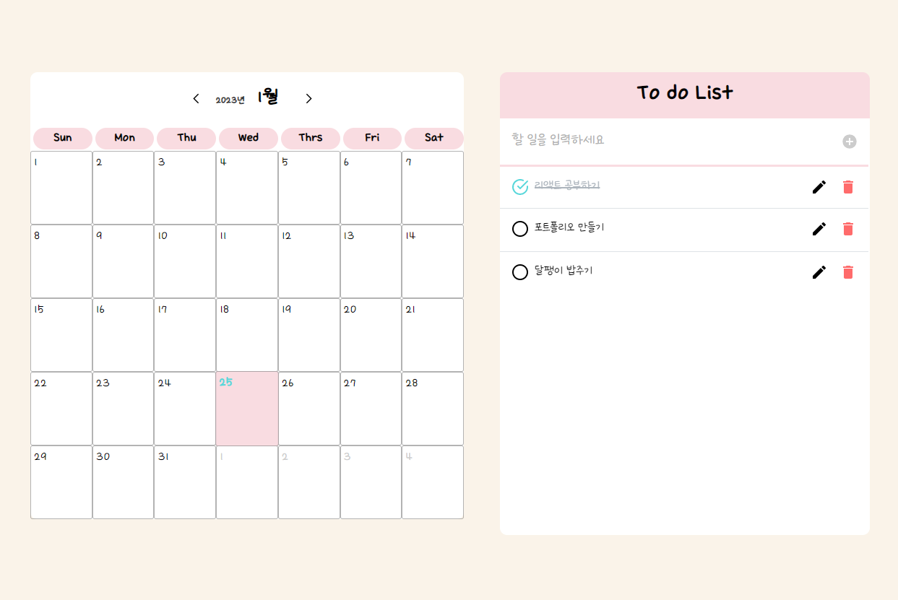

# :memo: To do list

> To do List의 페이지
 

**REACT**를 사용하여 만든 **Todo List** 입니다.

To do list라는 목적에 맞게 한 눈에 들어오는 디자인으로 구성하였으며
완료된 일에는 체크를 할 수 있도록 하였고, 할 일을 잘못 작성했을 경우에는 모달을 띄워 수정할 수 있도록 기능을 추가하였습니다. 

또한, 삭제 시 경고창을 띄워 사용자의 실수를 줄이는 등 UX를 고려하여 구현하였습니다.

캘린더를 추가하여 클릭 시에 날짜 별로 해당 일자의 할 일을 볼 수 있도록 하였습니다.(작업중)

---
## :pushpin: 사용 언어
### :small_blue_diamond: REACT

React-Router라이브러리를 사용하여 각각의 페이지를 구현하였습니다.

---

## :pushpin: 사용된 기능
:pencil2: **수정**기능

:wastebasket: **삭제**기능

:heavy_plus_sign: **추가**기능

:heavy_check_mark: **체크**기능

:date: **캘린더**기능

## :link: Link
http://limjihye0927.dothome.co.kr/
